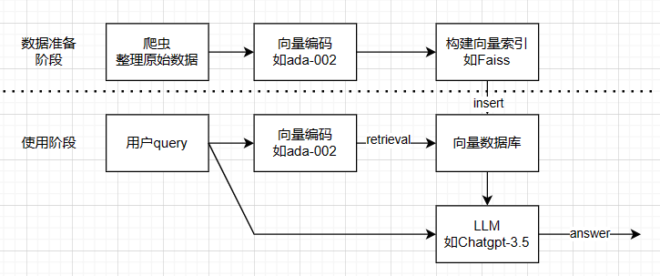
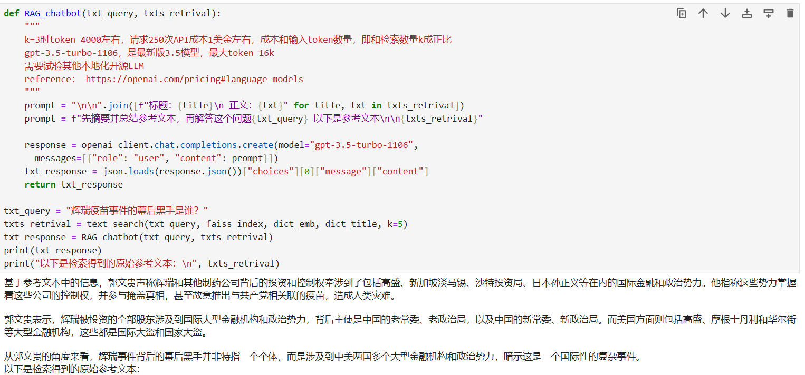

# chatbot_milesguo

This is a demonstration of using RAG + LLM to build a chatbot, written in a Python Jupyter Notebook.  

## Installation:  
1. install python libraries, pip3 install -r requirements  
2. register openai API on https://platform.openai.com/   
3. write your openai API key to "openai_key.txt"  
4. run jupyter notebook in a terminal  
## use search only, 10000 call cost $1 on your openai budget
5. open search.ipynb in browser  
## use chatbot, 250 call cost $1 on your openai budget
6. open chatbot.ipynb in browser  

   
The process involves:  

Downloading text from Miles Guo's speeches from https://gwins.org/  
Processing and split the text.  
Vectorizing sentences using OpenAI's sentence-embedding model 'ada 002'.  
Building a simple vector search index with FAISS.  
Performing Retrival Augmented Generation (RAG) by making calls to the OpenAI ChatGPT-3.5 API.  

