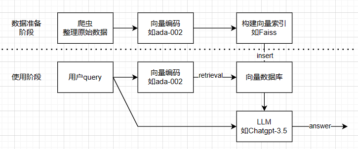
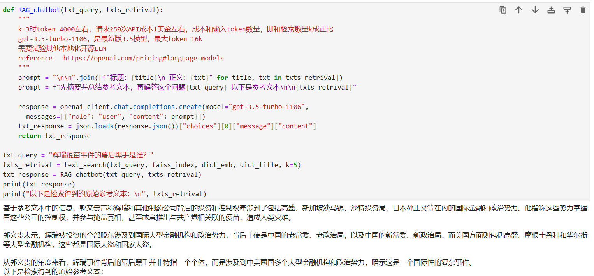

# chatbot_milesguo

This is a demonstration of using RAG + LLM to build a chatbot, written in a Python Jupyter Notebook.  
author: pannixilin  
https://gettr.com/user/pannixilin1  

## Installation:  
1. install python libraries, pip3 install -r requirements  
2. register openai API on https://platform.openai.com/   
3. write your openai API key to "openai_key.txt"  
4. run jupyter notebook in a terminal  
## use search only, 10000 call cost $1 on your openai budget
5. open search.ipynb in browser  
## use chatbot, 250 call cost $1 on your openai budget
6. open chatbot.ipynb in browser  

## Webpage (Developing)

https://pannixilinnfsc.github.io/chatbot_milesguo/  

The process involves:  

Downloading text from Miles Guo's speeches from https://gwins.org/  
Processing and split the text.  
Vectorizing sentences using OpenAI's sentence-embedding model 'ada 002'.  
Building a simple vector search index with FAISS.  
Performing Retrival Augmented Generation (RAG) by making calls to the OpenAI ChatGPT-3.5 API.  

网站声明

欢迎访问[爆料革命文库内容问答机器人]（以下简称"本网站"）！

网站目的：
本网站旨在通过数据检索和聊天机器人的形式帮助用户理解和检索以[郭文贵]先生直播的字幕内容为核心的，爆料革命和新中国联邦的2000万字核心文本。
1.为战友提供易于访问和理解的信息，以促进知识的传播和共享。
2.方便路人快速了解关于 爆料革命/新中国联邦/郭文贵先生 的核心信息。

代码开源：
本网站所有代码全部开源
https://github.com/pannixilinNFSC/chatbot_milesguo

数据来源：
本网站的全部数据内容来自于：https://gwins.org/ 数据版权归原网站所有。

外部工具：
本网站调用openai sentence embedding ada-002 作为文本编码工具。
本网站调用openai chatgpt-3.5 作为文本生成模型。

免责声明：
本网站的内容仅供信息和参考之用，不构成法律、医疗、金融或其他专业建议。读者在使用本网站提供的信息时应谨慎，自行承担风险。本网站不对因使用本站内容而引发的任何后果承担责任。

隐私政策：
本网站尊重用户隐私，不会收集和分析用户ip地址和输入文本等信息。

作者信息：
本网站的内容由[盘尼西林]编写。[盘尼西林]是GETTR工程师，GCLUB会员，已加入加拿大红叶农场。但开发此网站属于个人行为与任何公司或组织无关。此网站的解释权归个人所有。

联系方式：
如果您有任何问题、建议或意见，欢迎通过以下方式与我联系：
- 社交媒体: https://gettr.com/user/pannixilin1

变更通知：
本网站声明的内容可能随时发生变更，变更后的声明将在本网站上公布。请定期查看以获取最新信息。
感谢您访问本网站，我们希望您能在这里找到有用的资源和信息！

[2023-12-17]
